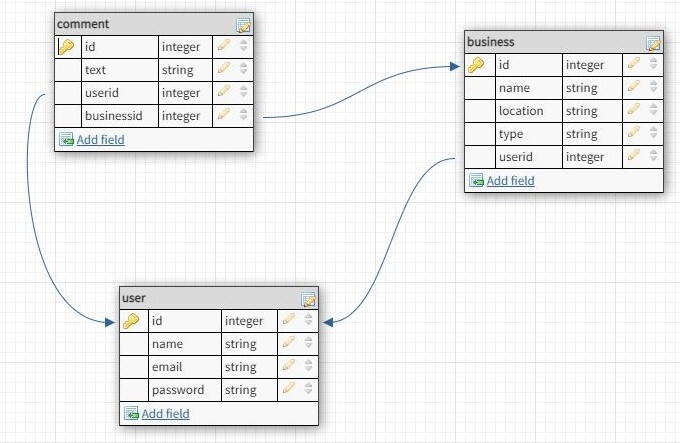

# welp_frontend

​
Welp is an application similar to --REDACTED--, where a business can add their services, and a user can leave a review, and just like --REDACTED-- you can also leave a rating.
​

## WireFrames

​

### Landing Page

​

​

### Landing Page with drop down

​

​

### Sign up Page

​

​

### Login Page

​

### LoggedIn Page

​

- As soon as the landing page loads, you are greeted with a unique and personalized brand logo along with a background that has an urban feel.
- The user can sign up or login from the landing page.
- When the user searches for a business, a drop down conveniently shows what businesses are already available.
  ​

## Routes

​
​

## MVP goals

​

<!-- insert mvp here -->

​

## ERD

​

